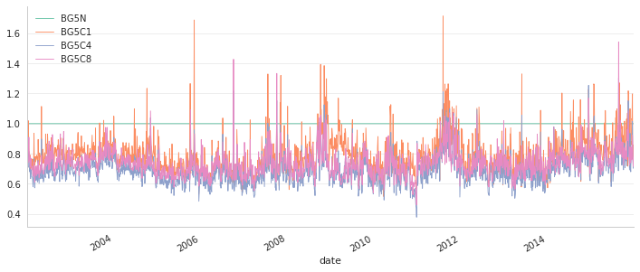

```python
import numpy as np
import pandas as pd
import itertools as it 
import gc 
import sys,os 
import yaml
import matplotlib.pyplot as plt
import multiprocessing as mp
import warnings; warnings.simplefilter('ignore')
pd.set_option('display.float_format', '{: 0.2f}'.format)
import statsmodels.api as sm 
%matplotlib inline
def tostr(num,pad=3):
    num = str(num)
    period_chunks = num.split('.')
    if len(period_chunks) == 2:
        deci = period_chunks[1]
        if len(deci) < pad:
            deci = deci.ljust(pad,"0")
        num = period_chunks[0] + "." + deci 
    return num 
```

# 1. Models with DPCP

\begin{equation}\label{eq:vecmpcp}
    \begin{bmatrix}
        \Delta\epsilon^{PO}\_{i,t} \\ \Delta\epsilon^{PI}\_{i,t}\\ \Delta\epsilon^{CO}\_{i,t}\\ \Delta\epsilon^{CI}\_{i,t}
    \end{bmatrix} = 
    \begin{bmatrix}
        q^{PO}\_{i}DPCP\_{i,t-1} \\ q^{PI}\_{i}DPCP\_{i,t-1}\\ q^{CO}\_{i}DPCP\_{i,t-1}\\ q^{CI}\_{i}DPCP\_{i,t-1}
    \end{bmatrix} + 
    \sum\_{k=1}^M \begin{bmatrix}
        p^{PO}\_{k,i}\Delta\epsilon^{PO}\_{i,t-k} \\ p^{PI}\_{k,i}\Delta\epsilon^{PI}\_{i,t-k}\\ p^{CO}\_{k,i}\Delta\epsilon^{CO}\_{i,t-k}\\ p^{CI}\_{k,i}\Delta\epsilon^{CI}\_{i,t-k}
    \end{bmatrix}+
    \begin{bmatrix}
        \eta^{PO}\_{i,t} \\ \eta^{PI}\_{i,t}\\ \eta^{CO}\_{i,t}\\ \eta^{CI}\_{i,t}
    \end{bmatrix}
\end{equation}

## Model 1
Put or call options have the same mean reversion rate.

$q^{PO}\_{j}$ =$q^{PI}\_{j}$

$q^{PO}\_{i}=q^{PI}\_{i}$ and $q^{CO}\_{i}=q^{CI}\_{i}$

$p^{PO}\_{k,i}=p^{PI}\_{k,i}=p^{CO}\_{k,i}=p^{CI}\_{k,i}=0$ for $k = 1,2,...,M$

## Model 2
In or Out of money options have same mean reversion rate for both put and call. 

$q^{PO}\_{i}=q^{CO}\_{i}$ and $q^{PI}\_{i}=q^{CI}\_{i}$

$p^{PO}\_{k,i}=p^{PI}\_{k,i}=p^{CO}\_{k,i}=p^{CI}\_{k,i}=0$ for $k = 1,2,...,M$

## Model 3
No restrictions on $q$

$p^{PO}\_{k,i}=p^{PI}\_{k,i}=p^{CO}\_{k,i}=p^{CI}\_{k,i}=0$ for $k = 1,2,...,M$

## Model 4
Full version of VECM, no restriction for both $q$ and $p$ (max $M$ = 5). 

# 2. General Time series Model (AR for $\epsilon\_{i,t}$)

\begin{equation}
    \begin{bmatrix}
        \epsilon^{PO}\_{i,t} \\ \epsilon^{PI}\_{i,t}\\ \epsilon^{CO}\_{i,t}\\ \epsilon^{CI}\_{i,t}
    \end{bmatrix} = 
    \sum\_{k=1}^M \begin{bmatrix}
        p^{PO}\_{k,i}\epsilon^{PO}\_{i,t-k} \\ p^{PI}\_{k,i}\epsilon^{PI}\_{i,t-k}\\ p^{CO}\_{k,i}\epsilon^{CO}\_{i,t-k}\\ p^{CI}\_{k,i}\epsilon^{CI}\_{i,t-k}
    \end{bmatrix}+
    \begin{bmatrix}
        \eta^{PO}\_{i,t} \\ \eta^{PI}\_{i,t}\\ \eta^{CO}\_{i,t}\\ \eta^{CI}\_{i,t}
    \end{bmatrix}  
\end{equation}

## Model 5
In or Out of money options have same mean reversion rate for both put and call. 

$p^{PO}\_{k,i}=p^{CO}\_{k,i}$ and $p^{PI}\_{k,i}=p^{CI}\_{k,i}$

M =1

## Model 6
Put or call options have the same mean reversion rate.

$p^{PO}\_{k,i}=p^{PI}\_{k,i}$ and $p^{CO}\_{k,i}=p^{CI}\_{k,i}$

M = 1

## Model 7
No restrictions on $p$

M = 1

## Model 8
No restriction on $p$ and $M$ (max $M$ = 5).

# 3. Summary statistics of $q$ and $p$

## 3.1 Mean and Standard Deviations


```python
mod = 'BG5'
specs = ['model'+str(i) for i in range(1,9)]
pandq = {}
with pd.HDFStore('PandQ.h5','r') as hdf:
    for spec in specs:
        pandq[spec] = hdf[spec]['params']
        
def formuOne(tmp):
    table = pd.concat(tmp)
    idx = [['model1','model1','model2','model2','model3','model3','model3','model3','model4','model4','model4','model4',],
           ['C','P','I','O','CI','CO','PI','PO','CI','CO','PI','PO']]
    idx = list(zip(*idx))
    idx = pd.MultiIndex.from_tuples(idx)
    table.index=idx
    table = table[['PCPL1','BG5ED2','BG5ED3','BG5ED4','BG5ED5']]
    table.columns = ['q','p1','p2','p3','p4']
    table1 = table.round(3).astype(str).replace('nan','   ')
    return table1


def formuTwo(tmp):
    table = pd.concat(tmp)
    idx = [['model5','model5','model6','model6','model7','model7','model7','model7','model8','model8','model8','model8',],
           ['C','P','I','O','CI','CO','PI','PO','CI','CO','PI','PO']]
    idx = list(zip(*idx))
    idx = pd.MultiIndex.from_tuples(idx)
    table.index=idx
    table = table[['BG5EL1','BG5EL2','BG5EL3','BG5EL4','BG5EL5']]
    table.columns = ['p1','p2','p3','p4','p5']
    table2 = table.round(3).astype(str).replace('nan','   ')
    return table2

mean,std = {},{}
for spec in specs:
    mean[spec] = pandq[spec].groupby(level=1).mean()
    std[spec] = pandq[spec].groupby(level=1).std()
    
tmp1,tmp2 = [],[]
for i in range(1,5):
    tmp1.append(mean['model'+str(i)])
    tmp2.append(std['model'+str(i)])
    
tmp3,tmp4 = [],[]
for i in range(5,9):
    tmp3.append(mean['model'+str(i)])
    tmp4.append(std['model'+str(i)])

tab1m = formuOne(tmp1)
tab1d = formuOne(tmp2)
tab2m = formuTwo(tmp3)
tab2d = formuTwo(tmp4)

tab1 = pd.DataFrame(index=tab1m.index,columns=tab1m.columns,dtype=object)
tab2 = pd.DataFrame(index=tab2m.index,columns=tab2m.columns,dtype=object)
for i in range(tab1m.shape[0]):
    for j in range(tab1d.shape[1]):
        tab1.iloc[i,j] = tab1m.iloc[i,j]+"("+tab1d.iloc[i,j]+")"
        tab2.iloc[i,j] = tab2m.iloc[i,j]+"("+tab2d.iloc[i,j]+")"
tab1.iloc[:8,1:] = "   "
tab2.iloc[:8,1:] = "   "
print("Models with DPCP")
tab1
```

    Models with DPCP


<div>
<style>
    .dataframe thead tr:only-child th {
        text-align: right;
    }

    .dataframe thead th {
        text-align: left;
    }

    .dataframe tbody tr th {
        vertical-align: top;
    }
</style>
<table border="1" class="dataframe">
  <thead>
    <tr style="text-align: right;">
      <th></th>
      <th></th>
      <th>q</th>
      <th>p1</th>
      <th>p2</th>
      <th>p3</th>
      <th>p4</th>
    </tr>
  </thead>
  <tbody>
    <tr>
      <th rowspan="2" valign="top">model1</th>
      <th>C</th>
      <td>1.293(0.326)</td>
      <td></td>
      <td></td>
      <td></td>
      <td></td>
    </tr>
    <tr>
      <th>P</th>
      <td>-1.199(0.309)</td>
      <td></td>
      <td></td>
      <td></td>
      <td></td>
    </tr>
    <tr>
      <th rowspan="2" valign="top">model2</th>
      <th>I</th>
      <td>0.467(0.214)</td>
      <td></td>
      <td></td>
      <td></td>
      <td></td>
    </tr>
    <tr>
      <th>O</th>
      <td>-0.368(0.19)</td>
      <td></td>
      <td></td>
      <td></td>
      <td></td>
    </tr>
    <tr>
      <th rowspan="4" valign="top">model3</th>
      <th>CI</th>
      <td>1.417(0.327)</td>
      <td></td>
      <td></td>
      <td></td>
      <td></td>
    </tr>
    <tr>
      <th>CO</th>
      <td>1.036(0.341)</td>
      <td></td>
      <td></td>
      <td></td>
      <td></td>
    </tr>
    <tr>
      <th>PI</th>
      <td>-1.52(0.451)</td>
      <td></td>
      <td></td>
      <td></td>
      <td></td>
    </tr>
    <tr>
      <th>PO</th>
      <td>-1.057(0.279)</td>
      <td></td>
      <td></td>
      <td></td>
      <td></td>
    </tr>
    <tr>
      <th rowspan="4" valign="top">model4</th>
      <th>CI</th>
      <td>0.568(0.156)</td>
      <td>-0.581(0.068)</td>
      <td>-0.399(0.07)</td>
      <td>-0.247(0.053)</td>
      <td>-0.121(0.039)</td>
    </tr>
    <tr>
      <th>CO</th>
      <td>0.428(0.181)</td>
      <td>-0.58(0.085)</td>
      <td>-0.393(0.088)</td>
      <td>-0.227(0.062)</td>
      <td>-0.11(0.035)</td>
    </tr>
    <tr>
      <th>PI</th>
      <td>-0.551(0.195)</td>
      <td>-0.605(0.062)</td>
      <td>-0.414(0.061)</td>
      <td>-0.255(0.046)</td>
      <td>-0.122(0.026)</td>
    </tr>
    <tr>
      <th>PO</th>
      <td>-0.398(0.121)</td>
      <td>-0.581(0.069)</td>
      <td>-0.391(0.073)</td>
      <td>-0.228(0.049)</td>
      <td>-0.113(0.031)</td>
    </tr>
  </tbody>
</table>
</div>


```python
print("General Time Series Model (AR for residuals)")
tab2
```

    General Time Series Model (AR for residuals)


<div>
<style>
    .dataframe thead tr:only-child th {
        text-align: right;
    }

    .dataframe thead th {
        text-align: left;
    }

    .dataframe tbody tr th {
        vertical-align: top;
    }
</style>
<table border="1" class="dataframe">
  <thead>
    <tr style="text-align: right;">
      <th></th>
      <th></th>
      <th>p1</th>
      <th>p2</th>
      <th>p3</th>
      <th>p4</th>
      <th>p5</th>
    </tr>
  </thead>
  <tbody>
    <tr>
      <th rowspan="2" valign="top">model5</th>
      <th>C</th>
      <td>0.539(0.114)</td>
      <td></td>
      <td></td>
      <td></td>
      <td></td>
    </tr>
    <tr>
      <th>P</th>
      <td>0.5(0.13)</td>
      <td></td>
      <td></td>
      <td></td>
      <td></td>
    </tr>
    <tr>
      <th rowspan="2" valign="top">model6</th>
      <th>I</th>
      <td>0.511(0.12)</td>
      <td></td>
      <td></td>
      <td></td>
      <td></td>
    </tr>
    <tr>
      <th>O</th>
      <td>0.534(0.127)</td>
      <td></td>
      <td></td>
      <td></td>
      <td></td>
    </tr>
    <tr>
      <th rowspan="4" valign="top">model7</th>
      <th>CI</th>
      <td>0.538(0.112)</td>
      <td></td>
      <td></td>
      <td></td>
      <td></td>
    </tr>
    <tr>
      <th>CO</th>
      <td>0.539(0.137)</td>
      <td></td>
      <td></td>
      <td></td>
      <td></td>
    </tr>
    <tr>
      <th>PI</th>
      <td>0.455(0.146)</td>
      <td></td>
      <td></td>
      <td></td>
      <td></td>
    </tr>
    <tr>
      <th>PO</th>
      <td>0.531(0.127)</td>
      <td></td>
      <td></td>
      <td></td>
      <td></td>
    </tr>
    <tr>
      <th rowspan="4" valign="top">model8</th>
      <th>CI</th>
      <td>0.263(0.058)</td>
      <td>0.189(0.031)</td>
      <td>0.152(0.015)</td>
      <td>0.12(0.019)</td>
      <td>0.11(0.033)</td>
    </tr>
    <tr>
      <th>CO</th>
      <td>0.291(0.084)</td>
      <td>0.178(0.04)</td>
      <td>0.152(0.041)</td>
      <td>0.098(0.034)</td>
      <td>0.085(0.03)</td>
    </tr>
    <tr>
      <th>PI</th>
      <td>0.243(0.068)</td>
      <td>0.176(0.032)</td>
      <td>0.139(0.02)</td>
      <td>0.108(0.017)</td>
      <td>0.091(0.02)</td>
    </tr>
    <tr>
      <th>PO</th>
      <td>0.288(0.073)</td>
      <td>0.184(0.034)</td>
      <td>0.152(0.029)</td>
      <td>0.097(0.024)</td>
      <td>0.089(0.025)</td>
    </tr>
  </tbody>
</table>
</div>


## 3.2 T test for equal mean

Models with DPCP


```python
from scipy.stats import ttest_ind

def typeOneTest(model,on,var):
    view = pandq[model]
    on1, on2 = on[0], on[1]
    s1 = view.loc[(slice(None),on1),var].abs().values
    s2 = view.loc[(slice(None),on2),var].abs().values
    t,p = ttest_ind(s1,s2,equal_var=True)
    return t,p

def typeTwoTest(model,on,var):
    view = pandq[model]
    on1, on2, on3, on4 = on[0], on[1],on[2], on[3]
    s1 = view.loc[(slice(None),on1),var].abs().values
    s2 = view.loc[(slice(None),on2),var].abs().values
    s3 = view.loc[(slice(None),on3),var].abs().values
    s4 = view.loc[(slice(None),on4),var].abs().values
    t1,p1 = ttest_ind(s1,s2,equal_var=True)
    t2,p2 = ttest_ind(s3,s4,equal_var=True)
    return t1,p1,t2,p2

ttest = {}
ttest['model1'] = typeOneTest('model1',['P','C'],'PCPL1')
ttest['model2'] = typeOneTest('model2',['I','O'],'PCPL1')
ttest['model3'] = typeTwoTest('model3',['PI','PO','CI','CO'],'PCPL1')
tmp = []
for col in pandq['model4'].columns:
    tmp.append(typeTwoTest('model4',['PI','PO','CI','CO'],col))
ttest['model4'] = tmp

ttest['model5'] = typeOneTest('model5',['P','C'],'BG5EL1')
ttest['model6'] = typeOneTest('model6',['I','O'],'BG5EL1')
ttest['model7'] = typeTwoTest('model7',['PI','PO','CI','CO'],'BG5EL1')
tmp = []
for col in pandq['model8'].columns:
    tmp.append(typeTwoTest('model8',['PI','PO','CI','CO'],col))
ttest['model8'] = tmp

idx = [['model1','model2','model3','model3','model4','model4',],
       ['PvC','IvO','PIvPO','CIvCO','PIvPO','CIvCO']]
idx = list(zip(*idx))
idx = pd.MultiIndex.from_tuples(idx)
tabt1 = pd.DataFrame(index=idx,columns=['q','p1','p2','p3','p4'],dtype=object)
tabt1.loc[('model1','PvC'),'q'] = tostr(np.round(ttest['model1'][0],3)) + "("+tostr(np.round(ttest['model1'][1],3))+")"
tabt1.loc[('model2','IvO'),'q'] = tostr(np.round(ttest['model2'][0],3)) + "("+tostr(np.round(ttest['model2'][1],3))+")"
tabt1.loc[('model3','PIvPO'),'q'] = tostr(np.round(ttest['model3'][0],3)) + "("+tostr(np.round(ttest['model3'][1],3))+")"
tabt1.loc[('model3','CIvCO'),'q'] = tostr(np.round(ttest['model3'][2],3)) + "("+tostr(np.round(ttest['model3'][3],3))+")"
for i, col in enumerate(['q','p1','p2','p3','p4']):
    tabt1.loc[('model4','PIvPO'),col] = tostr(np.round(ttest['model4'][i][0],3)) + "("+tostr(np.round(ttest['model4'][i][1],3))+")"
    tabt1.loc[('model4','CIvCO'),col] = tostr(np.round(ttest['model4'][i][2],3)) + "("+tostr(np.round(ttest['model4'][i][3],3))+")"

idx = [['model5','model6','model7','model7','model8','model8',],
       ['PvC','IvO','PIvPO','CIvCO','PIvPO','CIvCO']]
idx = list(zip(*idx))
idx = pd.MultiIndex.from_tuples(idx)
tabt2 = pd.DataFrame(index=idx,columns=['p1','p2','p3','p4','p5'],dtype=object)
tabt2.loc[('model5','PvC'),'p1'] = tostr(np.round(ttest['model5'][0],3)) + "("+tostr(np.round(ttest['model5'][1],3))+")"
tabt2.loc[('model6','IvO'),'p1'] = tostr(np.round(ttest['model6'][0],3)) + "("+tostr(np.round(ttest['model6'][1],3))+")"
tabt2.loc[('model7','PIvPO'),'p1'] = tostr(np.round(ttest['model7'][0],3)) + "("+tostr(np.round(ttest['model7'][1],3))+")"
tabt2.loc[('model7','CIvCO'),'p1'] = tostr(np.round(ttest['model7'][2],3)) + "("+tostr(np.round(ttest['model7'][3],3))+")"
for i, col in enumerate(['p1','p2','p3','p4','p5']):
    tabt2.loc[('model8','PIvPO'),col] = tostr(np.round(ttest['model8'][i][0],3)) + "("+tostr(np.round(ttest['model8'][i][1],3))+")"
    tabt2.loc[('model8','CIvCO'),col] = tostr(np.round(ttest['model8'][i][2],3)) + "("+tostr(np.round(ttest['model8'][i][3],3))+")"
tabt1.iloc[:4,1:] = "   "
tabt2.iloc[:4,1:] = "   "
tabt1
```

    Models with DPCP


<div>
<style>
    .dataframe thead tr:only-child th {
        text-align: right;
    }

    .dataframe thead th {
        text-align: left;
    }

    .dataframe tbody tr th {
        vertical-align: top;
    }
</style>
<table border="1" class="dataframe">
  <thead>
    <tr style="text-align: right;">
      <th></th>
      <th></th>
      <th>q</th>
      <th>p1</th>
      <th>p2</th>
      <th>p3</th>
      <th>p4</th>
    </tr>
  </thead>
  <tbody>
    <tr>
      <th>model1</th>
      <th>PvC</th>
      <td>-2.040(0.043)</td>
      <td></td>
      <td></td>
      <td></td>
      <td></td>
    </tr>
    <tr>
      <th>model2</th>
      <th>IvO</th>
      <td>3.122(0.002)</td>
      <td></td>
      <td></td>
      <td></td>
      <td></td>
    </tr>
    <tr>
      <th rowspan="2" valign="top">model3</th>
      <th>PIvPO</th>
      <td>8.561(0.000)</td>
      <td></td>
      <td></td>
      <td></td>
      <td></td>
    </tr>
    <tr>
      <th>CIvCO</th>
      <td>7.905(0.000)</td>
      <td></td>
      <td></td>
      <td></td>
      <td></td>
    </tr>
    <tr>
      <th rowspan="2" valign="top">model4</th>
      <th>PIvPO</th>
      <td>6.553(0.000)</td>
      <td>2.567(0.011)</td>
      <td>2.315(0.022)</td>
      <td>3.985(0.000)</td>
      <td>2.103(0.037)</td>
    </tr>
    <tr>
      <th>CIvCO</th>
      <td>5.742(0.000)</td>
      <td>0.097(0.923)</td>
      <td>0.558(0.578)</td>
      <td>2.432(0.016)</td>
      <td>2.089(0.038)</td>
    </tr>
  </tbody>
</table>
</div>


General Time Series Model (AR for residuals)


```python
tabt2
```

    General Time Series Model (AR for residuals)


<div>
<style>
    .dataframe thead tr:only-child th {
        text-align: right;
    }

    .dataframe thead th {
        text-align: left;
    }

    .dataframe tbody tr th {
        vertical-align: top;
    }
</style>
<table border="1" class="dataframe">
  <thead>
    <tr style="text-align: right;">
      <th></th>
      <th></th>
      <th>p1</th>
      <th>p2</th>
      <th>p3</th>
      <th>p4</th>
      <th>p5</th>
    </tr>
  </thead>
  <tbody>
    <tr>
      <th>model5</th>
      <th>PvC</th>
      <td>-2.198(0.029)</td>
      <td></td>
      <td></td>
      <td></td>
      <td></td>
    </tr>
    <tr>
      <th>model6</th>
      <th>IvO</th>
      <td>-1.295(0.197)</td>
      <td></td>
      <td></td>
      <td></td>
      <td></td>
    </tr>
    <tr>
      <th rowspan="2" valign="top">model7</th>
      <th>PIvPO</th>
      <td>-3.877(0.000)</td>
      <td></td>
      <td></td>
      <td></td>
      <td></td>
    </tr>
    <tr>
      <th>CIvCO</th>
      <td>-0.056(0.955)</td>
      <td></td>
      <td></td>
      <td></td>
      <td></td>
    </tr>
    <tr>
      <th rowspan="2" valign="top">model8</th>
      <th>PIvPO</th>
      <td>-4.457(0.000)</td>
      <td>-1.583(0.115)</td>
      <td>-3.752(0.000)</td>
      <td>3.684(0.000)</td>
      <td>0.401(0.689)</td>
    </tr>
    <tr>
      <th>CIvCO</th>
      <td>-2.690(0.008)</td>
      <td>2.152(0.033)</td>
      <td>-0.093(0.926)</td>
      <td>5.583(0.000)</td>
      <td>5.490(0.000)</td>
    </tr>
  </tbody>
</table>
</div>


# 4. In-sample Fit
## 4.1 RMSE over IVS

RMSE over entire surface


```python
with pd.HDFStore('ISFit.h5','r') as hdf:
    data = hdf['ISFit']
models = ['BG5']
modsF = [mod + 'N' for mod in models]
modsF += [mod + 'C' + str(i) for mod in models for i in range(1,9)]
maturG = ['short','medium','long']
deltaG = ['DOTMP','OTMP','ATMP','ITMP','DITMP','DITMC','ITMC','ATMC','OTMC','DOTMC']
for mod in modsF:
    data[mod] = data.eval("(imvol-%s)**2"%(mod))
rmse = np.sqrt(data.groupby(['ticker','date','delta_groups','mat_groups'])[modsF].mean())
tab = rmse.mean(level=[2,3])*100
for mod in modsF[1:]:
    tab[mod] = (tab[mod]-tab['BG5N'])/tab['BG5N']
tabs = tab.round(2).astype(str)
tabs['BG5C4'] = tabs['BG5C4'] + '*'
tabs.T[deltaG].T
```

    RMSE over entire surface


<div>
<style>
    .dataframe thead tr:only-child th {
        text-align: right;
    }

    .dataframe thead th {
        text-align: left;
    }

    .dataframe tbody tr th {
        vertical-align: top;
    }
</style>
<table border="1" class="dataframe">
  <thead>
    <tr style="text-align: right;">
      <th></th>
      <th></th>
      <th>BG5N</th>
      <th>BG5C1</th>
      <th>BG5C2</th>
      <th>BG5C3</th>
      <th>BG5C4</th>
      <th>BG5C5</th>
      <th>BG5C6</th>
      <th>BG5C7</th>
      <th>BG5C8</th>
    </tr>
    <tr>
      <th>delta_groups</th>
      <th>mat_groups</th>
      <th></th>
      <th></th>
      <th></th>
      <th></th>
      <th></th>
      <th></th>
      <th></th>
      <th></th>
      <th></th>
    </tr>
  </thead>
  <tbody>
    <tr>
      <th rowspan="3" valign="top">DOTMP</th>
      <th>long</th>
      <td>2.01</td>
      <td>-0.09</td>
      <td>-0.17</td>
      <td>-0.12</td>
      <td>-0.27*</td>
      <td>-0.2</td>
      <td>-0.2</td>
      <td>-0.2</td>
      <td>-0.26</td>
    </tr>
    <tr>
      <th>medium</th>
      <td>2.43</td>
      <td>-0.12</td>
      <td>-0.16</td>
      <td>-0.14</td>
      <td>-0.26*</td>
      <td>-0.19</td>
      <td>-0.2</td>
      <td>-0.2</td>
      <td>-0.23</td>
    </tr>
    <tr>
      <th>short</th>
      <td>2.92</td>
      <td>-0.13</td>
      <td>-0.14</td>
      <td>-0.15</td>
      <td>-0.22*</td>
      <td>-0.16</td>
      <td>-0.16</td>
      <td>-0.16</td>
      <td>-0.18</td>
    </tr>
    <tr>
      <th rowspan="3" valign="top">OTMP</th>
      <th>long</th>
      <td>1.19</td>
      <td>-0.16</td>
      <td>-0.18</td>
      <td>-0.17</td>
      <td>-0.29*</td>
      <td>-0.22</td>
      <td>-0.22</td>
      <td>-0.22</td>
      <td>-0.27</td>
    </tr>
    <tr>
      <th>medium</th>
      <td>1.35</td>
      <td>-0.17</td>
      <td>-0.15</td>
      <td>-0.17</td>
      <td>-0.27*</td>
      <td>-0.2</td>
      <td>-0.2</td>
      <td>-0.2</td>
      <td>-0.23</td>
    </tr>
    <tr>
      <th>short</th>
      <td>1.98</td>
      <td>-0.27</td>
      <td>-0.24</td>
      <td>-0.27</td>
      <td>-0.32*</td>
      <td>-0.23</td>
      <td>-0.24</td>
      <td>-0.24</td>
      <td>-0.25</td>
    </tr>
    <tr>
      <th rowspan="3" valign="top">ATMP</th>
      <th>long</th>
      <td>0.77</td>
      <td>-0.27</td>
      <td>-0.33</td>
      <td>-0.28</td>
      <td>-0.41*</td>
      <td>-0.31</td>
      <td>-0.32</td>
      <td>-0.32</td>
      <td>-0.37</td>
    </tr>
    <tr>
      <th>medium</th>
      <td>0.93</td>
      <td>-0.38</td>
      <td>-0.4</td>
      <td>-0.39</td>
      <td>-0.45*</td>
      <td>-0.35</td>
      <td>-0.36</td>
      <td>-0.36</td>
      <td>-0.39</td>
    </tr>
    <tr>
      <th>short</th>
      <td>1.3</td>
      <td>-0.32</td>
      <td>-0.31</td>
      <td>-0.33</td>
      <td>-0.37*</td>
      <td>-0.3</td>
      <td>-0.31</td>
      <td>-0.31</td>
      <td>-0.29</td>
    </tr>
    <tr>
      <th rowspan="3" valign="top">ITMP</th>
      <th>long</th>
      <td>0.91</td>
      <td>-0.34</td>
      <td>-0.36</td>
      <td>-0.31</td>
      <td>-0.46*</td>
      <td>-0.34</td>
      <td>-0.35</td>
      <td>-0.32</td>
      <td>-0.41</td>
    </tr>
    <tr>
      <th>medium</th>
      <td>1.01</td>
      <td>-0.4</td>
      <td>-0.39</td>
      <td>-0.37</td>
      <td>-0.48*</td>
      <td>-0.36</td>
      <td>-0.36</td>
      <td>-0.34</td>
      <td>-0.4</td>
    </tr>
    <tr>
      <th>short</th>
      <td>1.33</td>
      <td>-0.35</td>
      <td>-0.28</td>
      <td>-0.33</td>
      <td>-0.39*</td>
      <td>-0.31</td>
      <td>-0.31</td>
      <td>-0.29</td>
      <td>-0.31</td>
    </tr>
    <tr>
      <th rowspan="3" valign="top">DITMP</th>
      <th>long</th>
      <td>1.21</td>
      <td>-0.09</td>
      <td>0.01</td>
      <td>-0.07</td>
      <td>-0.22*</td>
      <td>-0.16</td>
      <td>-0.16</td>
      <td>-0.16</td>
      <td>-0.21</td>
    </tr>
    <tr>
      <th>medium</th>
      <td>1.39</td>
      <td>-0.11</td>
      <td>0.01</td>
      <td>-0.1</td>
      <td>-0.22*</td>
      <td>-0.17</td>
      <td>-0.17</td>
      <td>-0.16</td>
      <td>-0.2</td>
    </tr>
    <tr>
      <th>short</th>
      <td>1.74</td>
      <td>-0.13</td>
      <td>0.03</td>
      <td>-0.12</td>
      <td>-0.2*</td>
      <td>-0.15</td>
      <td>-0.14</td>
      <td>-0.14</td>
      <td>-0.16</td>
    </tr>
    <tr>
      <th rowspan="3" valign="top">DITMC</th>
      <th>long</th>
      <td>2.03</td>
      <td>-0.23</td>
      <td>-0.24</td>
      <td>-0.22</td>
      <td>-0.35*</td>
      <td>-0.25</td>
      <td>-0.25</td>
      <td>-0.26</td>
      <td>-0.33</td>
    </tr>
    <tr>
      <th>medium</th>
      <td>2.14</td>
      <td>-0.17</td>
      <td>-0.16</td>
      <td>-0.16</td>
      <td>-0.27*</td>
      <td>-0.19</td>
      <td>-0.19</td>
      <td>-0.19</td>
      <td>-0.25</td>
    </tr>
    <tr>
      <th>short</th>
      <td>2.72</td>
      <td>-0.19</td>
      <td>-0.15</td>
      <td>-0.18</td>
      <td>-0.25*</td>
      <td>-0.18</td>
      <td>-0.17</td>
      <td>-0.18</td>
      <td>-0.2</td>
    </tr>
    <tr>
      <th rowspan="3" valign="top">ITMC</th>
      <th>long</th>
      <td>0.71</td>
      <td>-0.15</td>
      <td>-0.2</td>
      <td>-0.13</td>
      <td>-0.28*</td>
      <td>-0.25</td>
      <td>-0.25</td>
      <td>-0.25</td>
      <td>-0.27</td>
    </tr>
    <tr>
      <th>medium</th>
      <td>0.88</td>
      <td>-0.32</td>
      <td>-0.34</td>
      <td>-0.3</td>
      <td>-0.39*</td>
      <td>-0.33</td>
      <td>-0.32</td>
      <td>-0.32</td>
      <td>-0.34</td>
    </tr>
    <tr>
      <th>short</th>
      <td>1.35</td>
      <td>-0.29</td>
      <td>-0.27</td>
      <td>-0.28</td>
      <td>-0.32*</td>
      <td>-0.28</td>
      <td>-0.27</td>
      <td>-0.27</td>
      <td>-0.25</td>
    </tr>
    <tr>
      <th rowspan="3" valign="top">ATMC</th>
      <th>long</th>
      <td>0.84</td>
      <td>-0.22</td>
      <td>-0.2</td>
      <td>-0.23</td>
      <td>-0.35*</td>
      <td>-0.27</td>
      <td>-0.27</td>
      <td>-0.27</td>
      <td>-0.32</td>
    </tr>
    <tr>
      <th>medium</th>
      <td>0.97</td>
      <td>-0.29</td>
      <td>-0.24</td>
      <td>-0.3</td>
      <td>-0.38*</td>
      <td>-0.3</td>
      <td>-0.3</td>
      <td>-0.3</td>
      <td>-0.32</td>
    </tr>
    <tr>
      <th>short</th>
      <td>1.4</td>
      <td>-0.27</td>
      <td>-0.17</td>
      <td>-0.27</td>
      <td>-0.32*</td>
      <td>-0.26</td>
      <td>-0.26</td>
      <td>-0.26</td>
      <td>-0.25</td>
    </tr>
    <tr>
      <th rowspan="3" valign="top">OTMC</th>
      <th>long</th>
      <td>0.93</td>
      <td>-0.16</td>
      <td>-0.12</td>
      <td>-0.18</td>
      <td>-0.3*</td>
      <td>-0.23</td>
      <td>-0.23</td>
      <td>-0.23</td>
      <td>-0.28</td>
    </tr>
    <tr>
      <th>medium</th>
      <td>1.06</td>
      <td>-0.17</td>
      <td>-0.09</td>
      <td>-0.18</td>
      <td>-0.28*</td>
      <td>-0.22</td>
      <td>-0.22</td>
      <td>-0.22</td>
      <td>-0.25</td>
    </tr>
    <tr>
      <th>short</th>
      <td>1.48</td>
      <td>-0.18</td>
      <td>-0.05</td>
      <td>-0.18</td>
      <td>-0.24*</td>
      <td>-0.18</td>
      <td>-0.19</td>
      <td>-0.19</td>
      <td>-0.19</td>
    </tr>
    <tr>
      <th rowspan="3" valign="top">DOTMC</th>
      <th>long</th>
      <td>1.24</td>
      <td>-0.21</td>
      <td>-0.21</td>
      <td>-0.27</td>
      <td>-0.39*</td>
      <td>-0.3</td>
      <td>-0.29</td>
      <td>-0.3</td>
      <td>-0.37</td>
    </tr>
    <tr>
      <th>medium</th>
      <td>1.42</td>
      <td>-0.2</td>
      <td>-0.16</td>
      <td>-0.25</td>
      <td>-0.36*</td>
      <td>-0.27</td>
      <td>-0.27</td>
      <td>-0.27</td>
      <td>-0.32</td>
    </tr>
    <tr>
      <th>short</th>
      <td>1.77</td>
      <td>-0.13</td>
      <td>0.0</td>
      <td>-0.15</td>
      <td>-0.22*</td>
      <td>-0.17</td>
      <td>-0.17</td>
      <td>-0.17</td>
      <td>-0.18</td>
    </tr>
  </tbody>
</table>
</div>


RMSE average each model


```python
tab.mean().T
```


    BG5N     1.45
    BG5C1   -0.22
    BG5C2   -0.19
    BG5C3   -0.22
    BG5C4   -0.32
    BG5C5   -0.24
    BG5C6   -0.25
    BG5C7   -0.24
    BG5C8   -0.28
    dtype: float64


## 4.2 In sample RMSE time series


```python
ts = rmse.mean(level=1)
for mod in modsF[1:]:
    ts[mod] = ts[mod]/ts['BG5N']
ts['BG5N'] = 1
import seaborn as sns
sns.set(context='notebook', style='whitegrid', palette='Set2')

sns.set_style("whitegrid", {'axes.grid' : False})
fig = plt.figure(figsize=(12,5))
ax = fig.add_subplot(111)
ts[['BG5N','BG5C1','BG5C4','BG5C8']][::2].plot(ax=ax,linewidth=0.9)
ax.yaxis.grid(which="major", color='#DCDCDC', linestyle='-', linewidth=0.5)
sns.despine()
```





# 5. Out of Sample Fit
## 5.1 RMSFE over IVS

RMSFE over entire surface


```python
with pd.HDFStore('OSFit.h5','r') as hdf:
    data = hdf['OSFit']

models = ['BG5']
modsF = [mod + 'N1' for mod in models]
modsF += [mod + 'C1' + str(i) for mod in models for i in range(1,9)]
maturG = ['short','medium','long']
deltaG = ['DOTMP','OTMP','ATMP','ITMP','DITMP','DITMC','ITMC','ATMC','OTMC','DOTMC']
for mod in modsF:
    data[mod] = data.eval("(imvol-%s)**2"%(mod))
rmse = np.sqrt(data.groupby(['ticker','date','delta_groups','mat_groups'])[modsF].mean())
tab = rmse.mean(level=[2,3])*100
for mod in modsF[1:]:
    tab[mod] = (tab[mod]-tab['BG5N1'])/tab['BG5N1']
tabs = tab.round(2).astype(str)

modmin = {}
for i in range(tab.shape[0]):
    modmin[i] = tab.iloc[i,:].argmin()
    tabs.iloc[i,:].loc[modmin[i]] += '**'

tabs.T[deltaG].T
```


<div>
<style>
    .dataframe thead tr:only-child th {
        text-align: right;
    }

    .dataframe thead th {
        text-align: left;
    }

    .dataframe tbody tr th {
        vertical-align: top;
    }
</style>
<table border="1" class="dataframe">
  <thead>
    <tr style="text-align: right;">
      <th></th>
      <th></th>
      <th>BG5N1</th>
      <th>BG5C11</th>
      <th>BG5C12</th>
      <th>BG5C13</th>
      <th>BG5C14</th>
      <th>BG5C15</th>
      <th>BG5C16</th>
      <th>BG5C17</th>
      <th>BG5C18</th>
    </tr>
    <tr>
      <th>delta_groups</th>
      <th>mat_groups</th>
      <th></th>
      <th></th>
      <th></th>
      <th></th>
      <th></th>
      <th></th>
      <th></th>
      <th></th>
      <th></th>
    </tr>
  </thead>
  <tbody>
    <tr>
      <th rowspan="3" valign="top">DOTMP</th>
      <th>long</th>
      <td>1.78</td>
      <td>-0.27</td>
      <td>-0.37</td>
      <td>-0.32</td>
      <td>-0.2</td>
      <td>-0.38</td>
      <td>-0.39</td>
      <td>-0.39</td>
      <td>-0.45**</td>
    </tr>
    <tr>
      <th>medium</th>
      <td>2.17</td>
      <td>-0.34</td>
      <td>-0.41</td>
      <td>-0.37</td>
      <td>-0.24</td>
      <td>-0.4</td>
      <td>-0.41</td>
      <td>-0.41</td>
      <td>-0.46**</td>
    </tr>
    <tr>
      <th>short</th>
      <td>2.72</td>
      <td>-0.38</td>
      <td>-0.45**</td>
      <td>-0.41</td>
      <td>-0.27</td>
      <td>-0.39</td>
      <td>-0.41</td>
      <td>-0.41</td>
      <td>-0.43</td>
    </tr>
    <tr>
      <th rowspan="3" valign="top">OTMP</th>
      <th>long</th>
      <td>1.03</td>
      <td>-0.35</td>
      <td>-0.37</td>
      <td>-0.36</td>
      <td>-0.2</td>
      <td>-0.41</td>
      <td>-0.43</td>
      <td>-0.43</td>
      <td>-0.44**</td>
    </tr>
    <tr>
      <th>medium</th>
      <td>1.15</td>
      <td>-0.37</td>
      <td>-0.37</td>
      <td>-0.38</td>
      <td>-0.19</td>
      <td>-0.41</td>
      <td>-0.42</td>
      <td>-0.42</td>
      <td>-0.43**</td>
    </tr>
    <tr>
      <th>short</th>
      <td>1.87</td>
      <td>-0.53</td>
      <td>-0.53**</td>
      <td>-0.53</td>
      <td>-0.37</td>
      <td>-0.45</td>
      <td>-0.47</td>
      <td>-0.47</td>
      <td>-0.48</td>
    </tr>
    <tr>
      <th rowspan="3" valign="top">ATMP</th>
      <th>long</th>
      <td>0.73</td>
      <td>-0.44</td>
      <td>-0.52**</td>
      <td>-0.46</td>
      <td>-0.4</td>
      <td>-0.47</td>
      <td>-0.48</td>
      <td>-0.48</td>
      <td>-0.5</td>
    </tr>
    <tr>
      <th>medium</th>
      <td>0.89</td>
      <td>-0.53</td>
      <td>-0.59**</td>
      <td>-0.55</td>
      <td>-0.47</td>
      <td>-0.49</td>
      <td>-0.51</td>
      <td>-0.51</td>
      <td>-0.53</td>
    </tr>
    <tr>
      <th>short</th>
      <td>1.37</td>
      <td>-0.59</td>
      <td>-0.65**</td>
      <td>-0.6</td>
      <td>-0.48</td>
      <td>-0.47</td>
      <td>-0.49</td>
      <td>-0.49</td>
      <td>-0.47</td>
    </tr>
    <tr>
      <th rowspan="3" valign="top">ITMP</th>
      <th>long</th>
      <td>0.88</td>
      <td>-0.46</td>
      <td>-0.54</td>
      <td>-0.42</td>
      <td>-0.43</td>
      <td>-0.47</td>
      <td>-0.49</td>
      <td>-0.44</td>
      <td>-0.54**</td>
    </tr>
    <tr>
      <th>medium</th>
      <td>0.99</td>
      <td>-0.5</td>
      <td>-0.56**</td>
      <td>-0.46</td>
      <td>-0.46</td>
      <td>-0.48</td>
      <td>-0.5</td>
      <td>-0.45</td>
      <td>-0.53</td>
    </tr>
    <tr>
      <th>short</th>
      <td>1.41</td>
      <td>-0.51</td>
      <td>-0.61**</td>
      <td>-0.46</td>
      <td>-0.45</td>
      <td>-0.45</td>
      <td>-0.47</td>
      <td>-0.42</td>
      <td>-0.45</td>
    </tr>
    <tr>
      <th rowspan="3" valign="top">DITMP</th>
      <th>long</th>
      <td>1.34</td>
      <td>-0.41</td>
      <td>-0.55**</td>
      <td>-0.33</td>
      <td>-0.32</td>
      <td>-0.42</td>
      <td>-0.44</td>
      <td>-0.39</td>
      <td>-0.33</td>
    </tr>
    <tr>
      <th>medium</th>
      <td>1.53</td>
      <td>-0.43</td>
      <td>-0.56**</td>
      <td>-0.35</td>
      <td>-0.34</td>
      <td>-0.42</td>
      <td>-0.45</td>
      <td>-0.4</td>
      <td>-0.33</td>
    </tr>
    <tr>
      <th>short</th>
      <td>2.01</td>
      <td>-0.43</td>
      <td>-0.57**</td>
      <td>-0.35</td>
      <td>-0.36</td>
      <td>-0.41</td>
      <td>-0.43</td>
      <td>-0.38</td>
      <td>-0.31</td>
    </tr>
    <tr>
      <th rowspan="3" valign="top">DITMC</th>
      <th>long</th>
      <td>2.32</td>
      <td>-0.37</td>
      <td>-0.62**</td>
      <td>-0.35</td>
      <td>-0.38</td>
      <td>-0.44</td>
      <td>-0.44</td>
      <td>-0.43</td>
      <td>-0.39</td>
    </tr>
    <tr>
      <th>medium</th>
      <td>2.49</td>
      <td>-0.33</td>
      <td>-0.59**</td>
      <td>-0.31</td>
      <td>-0.33</td>
      <td>-0.4</td>
      <td>-0.41</td>
      <td>-0.4</td>
      <td>-0.33</td>
    </tr>
    <tr>
      <th>short</th>
      <td>3.24</td>
      <td>-0.4</td>
      <td>-0.64**</td>
      <td>-0.38</td>
      <td>-0.38</td>
      <td>-0.42</td>
      <td>-0.43</td>
      <td>-0.41</td>
      <td>-0.33</td>
    </tr>
    <tr>
      <th rowspan="3" valign="top">ITMC</th>
      <th>long</th>
      <td>0.69</td>
      <td>-0.4</td>
      <td>-0.5**</td>
      <td>-0.38</td>
      <td>-0.33</td>
      <td>-0.46</td>
      <td>-0.47</td>
      <td>-0.46</td>
      <td>-0.43</td>
    </tr>
    <tr>
      <th>medium</th>
      <td>0.86</td>
      <td>-0.48</td>
      <td>-0.58**</td>
      <td>-0.46</td>
      <td>-0.42</td>
      <td>-0.49</td>
      <td>-0.5</td>
      <td>-0.48</td>
      <td>-0.47</td>
    </tr>
    <tr>
      <th>short</th>
      <td>1.46</td>
      <td>-0.56</td>
      <td>-0.68**</td>
      <td>-0.55</td>
      <td>-0.46</td>
      <td>-0.47</td>
      <td>-0.49</td>
      <td>-0.46</td>
      <td>-0.43</td>
    </tr>
    <tr>
      <th rowspan="3" valign="top">ATMC</th>
      <th>long</th>
      <td>0.76</td>
      <td>-0.44</td>
      <td>-0.48</td>
      <td>-0.46</td>
      <td>-0.35</td>
      <td>-0.48</td>
      <td>-0.5</td>
      <td>-0.49</td>
      <td>-0.52**</td>
    </tr>
    <tr>
      <th>medium</th>
      <td>0.89</td>
      <td>-0.49</td>
      <td>-0.52</td>
      <td>-0.5</td>
      <td>-0.4</td>
      <td>-0.5</td>
      <td>-0.52</td>
      <td>-0.51</td>
      <td>-0.53**</td>
    </tr>
    <tr>
      <th>short</th>
      <td>1.39</td>
      <td>-0.57</td>
      <td>-0.61**</td>
      <td>-0.58</td>
      <td>-0.45</td>
      <td>-0.49</td>
      <td>-0.51</td>
      <td>-0.51</td>
      <td>-0.48</td>
    </tr>
    <tr>
      <th rowspan="3" valign="top">OTMC</th>
      <th>long</th>
      <td>0.82</td>
      <td>-0.36</td>
      <td>-0.34</td>
      <td>-0.38</td>
      <td>-0.26</td>
      <td>-0.44</td>
      <td>-0.45</td>
      <td>-0.45</td>
      <td>-0.47**</td>
    </tr>
    <tr>
      <th>medium</th>
      <td>0.91</td>
      <td>-0.4</td>
      <td>-0.35</td>
      <td>-0.41</td>
      <td>-0.27</td>
      <td>-0.45</td>
      <td>-0.47**</td>
      <td>-0.46</td>
      <td>-0.46</td>
    </tr>
    <tr>
      <th>short</th>
      <td>1.37</td>
      <td>-0.48</td>
      <td>-0.44</td>
      <td>-0.49**</td>
      <td>-0.34</td>
      <td>-0.45</td>
      <td>-0.47</td>
      <td>-0.46</td>
      <td>-0.44</td>
    </tr>
    <tr>
      <th rowspan="3" valign="top">DOTMC</th>
      <th>long</th>
      <td>1.15</td>
      <td>-0.36</td>
      <td>-0.41</td>
      <td>-0.43</td>
      <td>-0.39</td>
      <td>-0.48</td>
      <td>-0.47</td>
      <td>-0.48</td>
      <td>-0.53**</td>
    </tr>
    <tr>
      <th>medium</th>
      <td>1.3</td>
      <td>-0.38</td>
      <td>-0.41</td>
      <td>-0.44</td>
      <td>-0.39</td>
      <td>-0.47</td>
      <td>-0.47</td>
      <td>-0.48</td>
      <td>-0.52**</td>
    </tr>
    <tr>
      <th>short</th>
      <td>1.7</td>
      <td>-0.37</td>
      <td>-0.37</td>
      <td>-0.42</td>
      <td>-0.33</td>
      <td>-0.42</td>
      <td>-0.43**</td>
      <td>-0.43</td>
      <td>-0.41</td>
    </tr>
  </tbody>
</table>
</div>


RMSE average each model


```python
tab.mean().T
```


    BG5N1     1.44
    BG5C11   -0.43
    BG5C12   -0.51
    BG5C13   -0.43
    BG5C14   -0.36
    BG5C15   -0.45
    BG5C16   -0.46
    BG5C17   -0.45
    BG5C18   -0.45
    dtype: float64


## 5.2 RMSFE time series


```python
ts = rmse.mean(level=1)
for mod in modsF[1:]:
    ts[mod] = ts[mod]/ts['BG5N1']
ts['BG5N1'] = 1
import seaborn as sns
sns.set(context='notebook', style='whitegrid', palette='Set2')

sns.set_style("whitegrid", {'axes.grid' : False})
fig = plt.figure(figsize=(12,5))
ax = fig.add_subplot(111)
ts[['BG5N1','BG5C12','BG5C14','BG5C18']][::2].plot(ax=ax,linewidth=0.9)
ax.yaxis.grid(which="major", color='#DCDCDC', linestyle='-', linewidth=0.5)
sns.despine()
```


